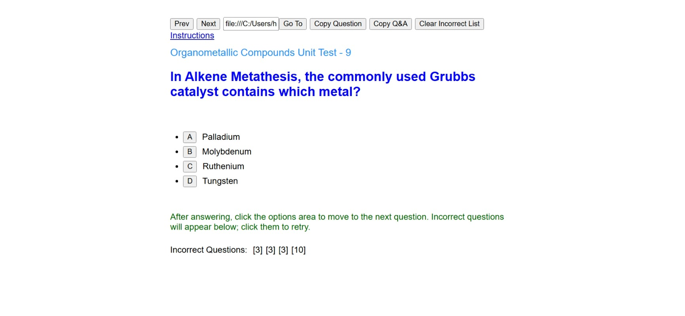

# 🚀 Quiz Grinder

A lightweight, serverless web application for practicing multiple-choice questions. This tool runs entirely in your browser using **Vue.js** and **LocalStorage** to track your progress without the need for a backend.

## 🛠 Features

* **Direct Navigation:** Jump to specific questions instantly using the "Go To" input.
* **Progress Persistence:** Your current question index and "Incorrect Questions" list are saved automatically in your browser's `localStorage`.
* **Incorrect List:** Any question you get wrong is added to a dynamic list at the bottom for quick retries.
* **AI Integration:** One-click buttons to format questions/answers into prompts for AI (Gemini, ChatGPT) for detailed explanations.
* **Mobile Responsive:** Clean, vanilla CSS layout designed for both desktop and mobile study sessions.

## 🚀 How to Run

You do not need a local server or complex environment setup. You can open it directly from your file system.

1.  **Clone or Download** this repository to your computer.
2.  **Ensure** your folder structure looks like this:
    ```plaintext
    quiz-grinder/
    ├── README.md
    ├── quiz-grinder.html      (The main application)
    └── organometalic.js       (The quiz data file)
    ```
3.  **Open the Quiz:**
    Copy the path below, replace `[PATH_TO_FOLDER]` with the actual location on your disk, and paste it into your browser's address bar:
    `file:///[PATH_TO_FOLDER]/quiz-grinder/quiz-grinder.html?organometalic`

## ⚙️ Technical Details

* **Framework:** Vue.js 3 (loaded via CDN).
* **Styling:** Vanilla CSS.
* **Data Format:** The quiz dynamically reads from a .js file defined in the URL query string (e.g., `?organometalic` loads `organometalic.js`).

## 🧪 Data Structure

To add a new quiz, create a `.js` file and ensure it follows this format:

```javascript
const questions = [
  {
    question: "What is the 18-electron rule?",
    options: ["Option A", "Option B", "Option C", "Option D"],
    answer: 0 // Index of the correct option
  }
];